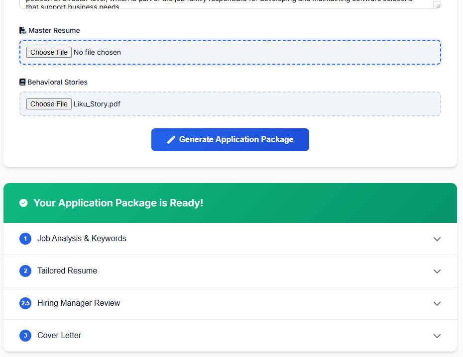
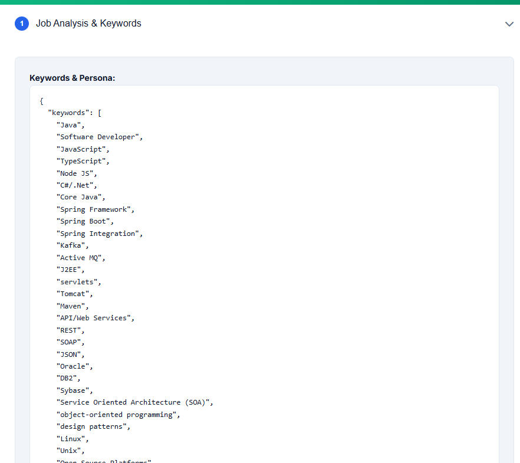
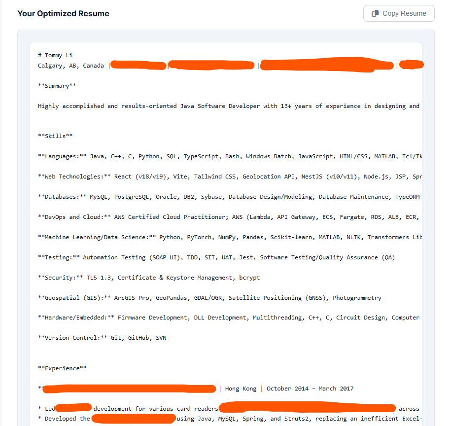
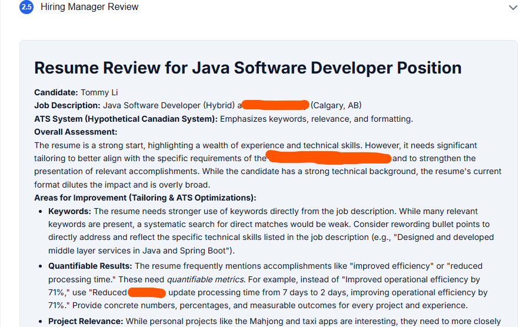
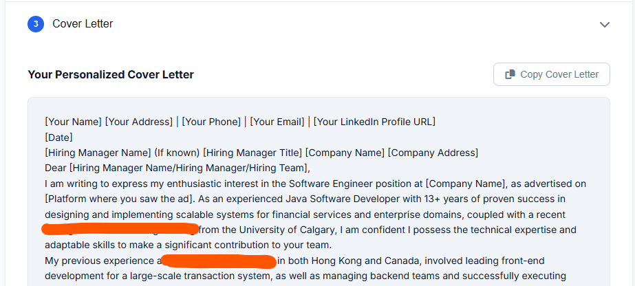

# AI Application Assistant

An AI-powered web application that customize tailored resumes and cover letters using FastAPI and Google Gemini AI. This tool analyzes job descriptions, extracts keywords, and creates professional application packages optimized for ATS systems.

## 🌟 Features

- **Job Description Analysis** - Extracts keywords and expected persona from job postings
- **Resume Tailoring** - Optimizes your master resume for specific job requirements
- **Cover Letter Generation** - Creates personalized cover letters based on your experience
- **ATS-Friendly Formatting** - Ensures compatibility with Applicant Tracking Systems
- **STAR Methodology Integration** - Incorporates behavioral stories for impactful achievements
- **Modern Web Interface** - Clean, responsive UI with real-time feedback

## 📸 Screenshots

### Main Input Page

*Main page to upload master resume, behavioral stories, and job description*

### Generation Results Overview

*Complete results page showing all generated application materials*

### Extracted Keywords & Analysis

*AI-extracted keywords and expected persona from job description*

### Optimized Resume Output

*AI-optimized resume tailored for the specific job requirements*

### Hiring Manager Review & ATS Feedback

*AI comments as hiring manager and ATS analysis with improvement suggestions*

### Generated Cover Letter

*Personalized cover letter generated based on job requirements and experience*

## 🚀 Quick Start

### Prerequisites

- Python 3.8+
- Google API key for Gemini AI
- Modern web browser

### Installation

1. **Clone the repository**
   ```bash
   git clone <repository-url>
   cd resume-app
   ```

2. **Install dependencies**
   ```bash
   pip install -r requirements.txt
   ```

3. **Set up environment variables**
   Create a `.env` file in the root directory:
   ```env
   GOOGLE_API_KEY=your_google_gemini_api_key_here
   ```

4. **Prepare guidance files (Optional)**
   Create a `guidance` folder and add your custom guidelines:
   ```
   guidance/
   ├── jd_extract_guidelines.txt
   ├── resume_formatting_guide.txt
   └── cover_letter_hints.txt
   ```

### Running the Application

#### Start the Backend Server
```bash
# From the root directory
uvicorn main:app --reload
```
The API will be available at `http://127.0.0.1:8000`

#### Start the Frontend Server
```bash
# Open a new terminal and navigate to frontend directory
cd frontend
python -m http.server 8080
```
The web interface will be available at `http://localhost:8080`

### Alternative Frontend Options

**Option 1: Live Server (if installed)**
```bash
cd frontend
live-server
```

**Option 2: Direct File Access**
Simply double-click `frontend/index.html` in your file explorer.

## 🛠️ Configuration

### AI Model Selection
You can choose different Gemini models based on your cost and performance needs:

```python
# In main.py, line ~110
model = genai.GenerativeModel('gemini-1.5-flash-8b')  # Cheapest option
# model = genai.GenerativeModel('gemini-1.5-flash')    # Balanced option
# model = genai.GenerativeModel('gemini-1.5-pro')      # Highest quality
```

### Test Mode
For development without API costs:
```python
# In main.py, line ~21
IS_TEST_MODE = True  # Set to True for mock responses
```

## 📁 Project Structure

```
resume-app/
├── main.py                 # FastAPI backend server
├── requirements.txt        # Python dependencies
├── .env                   # Environment variables (create this)
├── .gitignore            # Git ignore rules
├── README.md             # This file
├── frontend/             # Web interface
│   ├── index.html        # Main HTML file
│   └── script.js         # JavaScript functionality
├── guidance/             # AI guidance files (optional)
│   ├── jd_*.txt         # Job description guidelines
│   ├── resume_*.txt     # Resume formatting guides
│   └── cover_letter_*.txt # Cover letter templates
└── image/                # Screenshots for documentation
    ├── screen_cap1.png   # Main input page
    ├── screen_cap2.png   # Generation results overview
    ├── screen_cap3.png   # Extracted keywords analysis
    ├── screen_cap4.png   # Optimized resume output
    ├── screen_cap5.png   # Hiring manager review & ATS feedback
    └── screen_cap6.png   # Generated cover letter
```

## 🔧 API Endpoints

### Generate Complete Application Package
- **Endpoint**: `POST /generate-full-application/`
- **Description**: Processes job description, master resume, and behavioral stories to generate tailored application materials
- **Parameters**:
  - `job_description` (text): The job posting content
  - `master_resume_file` (file): PDF or TXT file of your master resume
  - `story_file` (file): PDF or TXT file containing your STAR behavioral stories
- **Response**: JSON object containing analysis, tailored resume, review feedback, and cover letter

### API Documentation
Visit `http://127.0.0.1:8000/docs` when the server is running for interactive API documentation.

## 💡 Usage Tips

1. **Master Resume**: Include comprehensive experience, skills, and achievements
2. **Behavioral Stories**: Use STAR format (Situation, Task, Action, Result) with quantified outcomes
3. **Job Description**: Copy the complete job posting for best keyword extraction
4. **File Formats**: Support for both PDF and TXT files
5. **Guidance Files**: Add custom guidelines in the `guidance/` folder for better results

## 🔍 Troubleshooting

### Common Issues

**API Key Error**
```
Error: Google Gemini API key is not configured
```
- Ensure your `.env` file contains a valid `GOOGLE_API_KEY`
- Check that the `.env` file is in the root directory

**File Upload Error**
```
Error: Unsupported file type
```
- Only PDF and TXT files are supported
- Check file permissions and size limits

**CORS Error**
```
Error: Cross-origin request blocked
```
- Ensure both frontend and backend servers are running
- Check that the API URL in `script.js` matches your backend server

**Rate Limiting**
```
Error: 429 Too Many Requests
```
- The app includes automatic retry logic with delays
- Consider using `gemini-1.5-flash-8b` for lower rate limits

## 🎯 Cost Optimization

- Use `gemini-1.5-flash-8b` model for lowest costs
- Enable test mode during development
- Remove unnecessary delays between API calls if rate limits allow
- Use shorter, more focused prompts

## 🤝 Contributing

1. Fork the repository
2. Create a feature branch
3. Make your changes
4. Test thoroughly
5. Submit a pull request

## 📄 License

This project is open source and available under the [MIT License](LICENSE).

## 🆘 Support

For issues and questions:
1. Check the troubleshooting section above
2. Review the API documentation at `/docs`
3. Create an issue in the repository
4. Ensure all dependencies are correctly installed

---

**Happy job hunting! 🎯**
